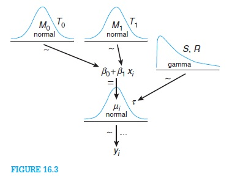

% Alert Fatigue Reduction Using Dynamical Boosting and Empirical Bayes
% Gobind Singh May 2014
% www.sr32.com/2013/

# notes:

>
>
	<!--	
	

  	<h1 class="title">Alert Fatigue Reduction</h1>
  	<h2>Using Dynamical Boosting and Empirical Bayes</h2>
  	

		Gobind Singh Nov 2013
  	

  	
www.sr32.com/2013/

	

	-->

- 	pandoc -s -S -i -t slidy --mathjax 1023.md -o view.html --self-contained

	pandoc -t slidy -s slides -o view
	docs pycco -w *.py

# motivation:
- Medical alerts provide positive benefits: reduced blood sugar variability, improved prescribing safety
- Joint Commision and FDA statement recognizing need for improvement 
- current alert fatigue(estimate of alerts ignored) at 70-80%

	>
	>

		(1)To test our hypotheses that, dynamical weights of boosting associated with the high entropy, 
		nearer to classification boundaries, relates to clinical points of interest
		(2)To increase the number of alerts relating to care and management of patients clinical state and 
		minimize alerts which do not
		(3)To provide criteria for meaningful medical use relating to effect size, feature variability, 
		and group differences

# boosting:
-- scatter plot:

-- heic plot:

 

-- hypothesis: lm

# patient data summary:
table
splom

# categorical data
-- weekday

# categorical data
-- coeff

# dataset 
-- 2 datasets were obtained

-- telehealth
-- ICU  survival_curve (kaplan-meier)
-- outlier/anomaly (seaborn, windML)
-- summary graphs:

# medical statistics
- study-types {rct, cohort, control}
-- increase information
- effect size (number of patients needed)

#alert classification labels
- bayes credible intervals
- association mapping
-- fp-tree
- mixture (fixed, generative)
- hash_kernel
- roulette method
- mcmc: 'hot-streak', sampling
-- network percolation
- SOS

# no_free_lunch
-- results of algos

# hard vs easy
- boosting

# bayes
- hierarchical model

- bayes action(pt estimate)
- design loss function 
- causal modeling
- multiple hypoth testing

# Priors
- kernel density estimate
- expert priors, roulette method
- poisson
- Weibull (rate_time_to_failure)

# big data
- calibration: 2 groups ICU, at-home telehealth
- validation: convergence of posterior
- sample_size
-- chernoff bound

# power curve analysis
- effect size

# joint posterior distribution
- graph of hard vs easy posteriors

# causal modeling
- time_of_day, gender, geography
- features
- generative model(latent model)
- inferring causation (p447 35.3)

# model comparison
- deviance (x2 , least-square-residual)
- simpson paradox (mcauley )
- occam factor (marginilization, mcauley)

# decision analysis
- prediction of care = P(#alert_distribution) + P(time_between_alerts)_weibull_prior + P(#alerts_unseen)
- cost optimization

# rate alert fatigue reduction
- comparison
- DIAS: diabetes; Watson: cancer; MYCIN: general internal med

	>
	>

		results

# meaningful
- statistical space vs biological space
- mean shift time series (iSAX)
- p_hard_+topfeature vs p_easy_+topfeature

# decision analysis
- dr monty - updated posterior 
- opt-bid - max expected return over posterior distribution
- P(INTV) - probability(intervention)=distribution_over_alerts + distribution_time_between

# future work
- logical depth (lanforth)

- visualiztion (recurrence)
	- marginal entropies (contour plots)

- disease modeling
	- boosting_on_a_budget_mab

- HARNESS
