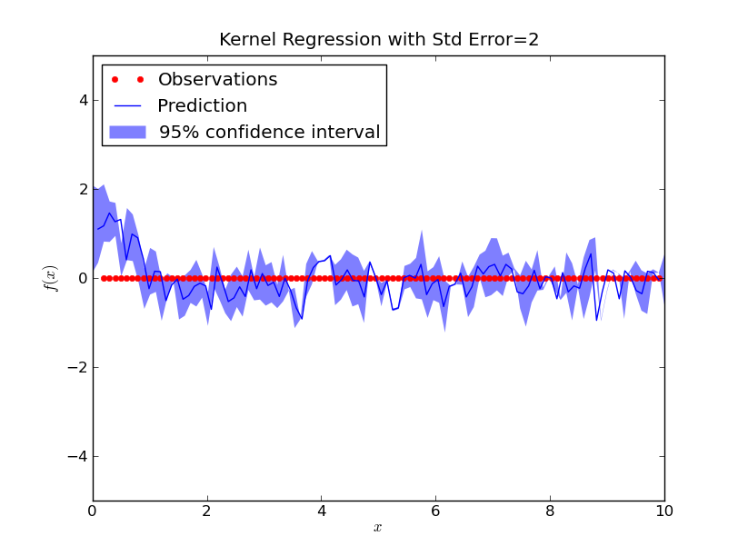

# notes:

- 	pandoc -s -S -i -t slidy --mathjax quickslide.md -o quickslide.html --self-contained

	pandoc -t slidy -s slides -o view
	docs pycco -w *.py

# data
-- Telehealth Readings/Day , %Change_Level

- 

-- ICU patients

- 

-- mimic patient expire

- 

-- demographic information

 

-- log-normal distribution

 

-- categorical data

weekday trend

# boosting:
(needs to be rerun over full dataset)
-- weights: 

-Weights/Iteration of Boosting
 

-- Hard/Easy/Correct/Incorrect plot:

 

-- logistic regression

 
 

# alerts
## need to be rerun
-- bootstrap ci (resample %_method, shown invariant to data normalization issues)

 

-- kernel regression

 

-- FFT
 

-- Bayes Change Point
 

# bayes
-- prediction of care = P(#alert_distribution) + P(time_between_alerts)_weibull_prior + P(#alerts_unseen)

-- effect size (number of patients needed)

-- roulette method
www.sr32	
-- possible models:

 
 design likelihood function 
 P(INTV) - probability(intervention)=distribution_over_alerts + distribution_time_between

causal modeling (Judea Perl)

# code + data
-- github.com/ansatz/project/

-- telehealth:
 I can deidentify and bootstrap the data, so the statistics are the same(mean, var) but the actual data is not shared.

-- MIMIC2:

 https://mimic2app.csail.mit.edu/
When registerig list Dr.Avitall. He will be contacted and then db access is given.

