% Alert Fatigue Reduction Using Dynamical Boosting and Empirical Bayes
% Gobind Singh May 2014
% www.sr32.com/2013/

\begin{note}
notes not printed
? how to display to self?
## formating
http://johnmacfarlane.net/pandoc/demo/example9/pandocs-markdown.html
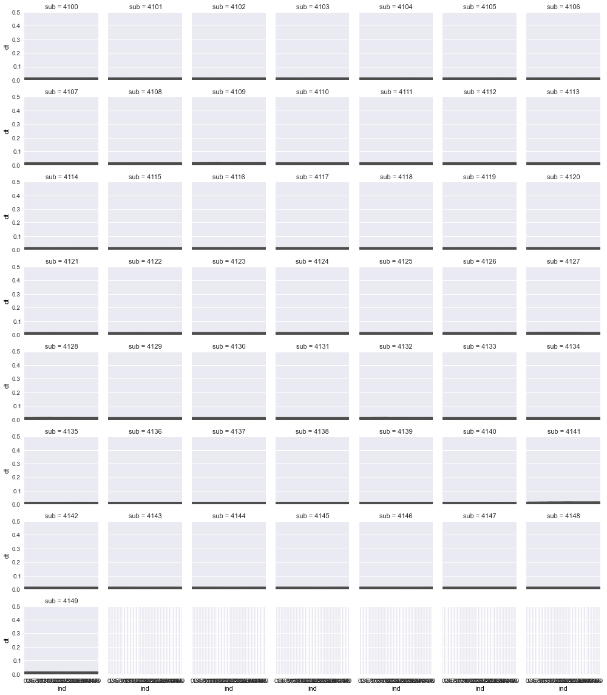
 Simple tables look like this:

  Right     Left     Center     Default
-------     ------ ----------   -------
     12     12        12            12
    123     123       123          123
      1     1          1             1

# notes:

>
>
	<!--	
	

  	<h1 class="title">Alert Fatigue Reduction</h1>
  	<h2>Using Dynamical Boosting and Empirical Bayes</h2>
  	

		Gobind Singh Nov 2013
  	

  	
www.sr32.com/2013/

	

	-->

	- 	echo pandoc -s -S -i -t slidy --mathjax quickslides.md -o qv.html --self-contained

	pandoc -t slidy -s slides -o view
	docs pycco -w *.py

slidify -> R to html5 slides
\end{note}

# 'project idea':
-- Caprile, B. et al, 2002, “The Dynamics of AdaBoost Weights Tells You What’s Hard to
Classify,” arXiv:cs/0201014 [cs.LG].

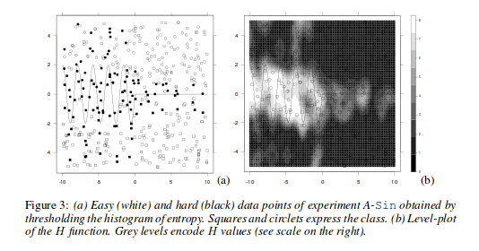
hard vs easy img
nurse icu img

-- workflow (exploratory, coefficient, bayesian analysis) 

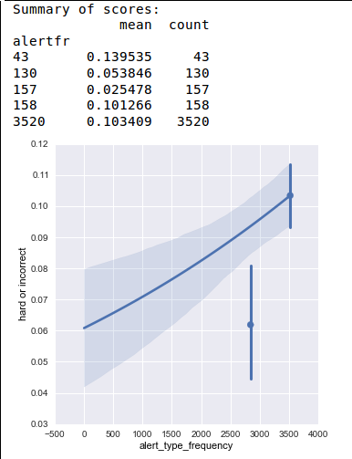
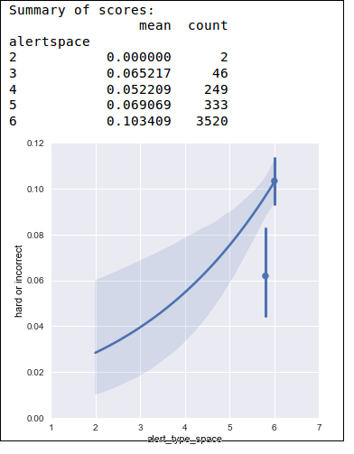

# outline
-- data

-- boosting

-- alert labels

-- alert parameters

-- coefficient analysis

-- hierarchical model

-- bayes

# data
-- data summary
-- time intervals

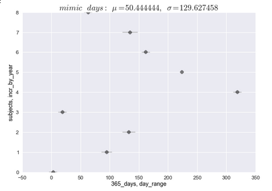
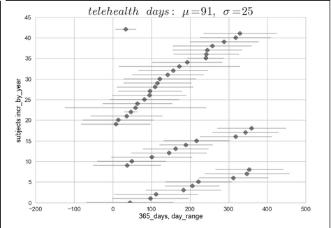

-- normal distribution
-- describe
	>summary.describe:
    time(avg)
    features(sex,geog,age)
    alertNo
-- jet, box-plot

# alerts

-------------------------------------------------------------------------

# boosting
--------------------------------------------------------------------------------------
weights   		     						boosting 
--------   								 	---------

--------------------------------------------------------------------------------------

--

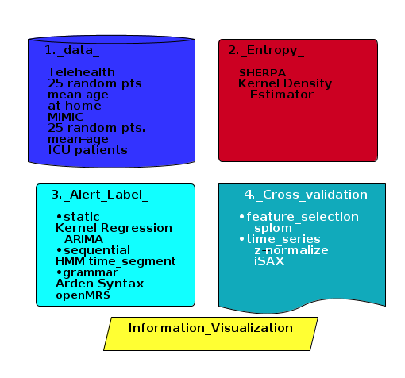

# datamining
-- 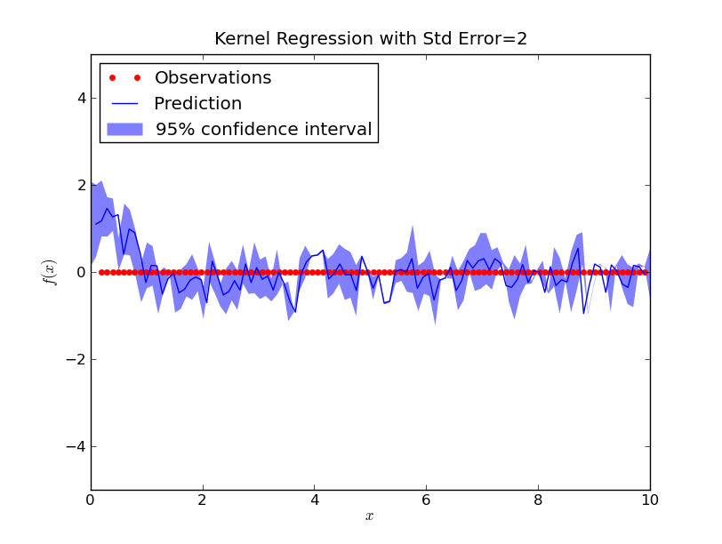

-- outlier(median, fft)
-- AUC/ROC score
-- feature selection

# alert parameter summary
-- faceted graph with point-plot and bar
-- 3d cross-tabulated hard,easy,inc,corr:
-- pie graph for total vs hard

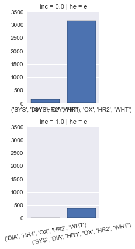

-- alert_frequency, alert_space

# sequential
-- alert reduction

# categorical data
-- weekday effect

# categorical data con't
-- coefficient (patsy model)
-- time_delta, sequence
-- hierarchical

# dataset 
-- 2 datasets were obtained
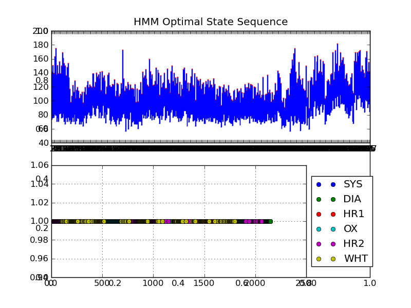
-- telehealth
-- ICU  survival_curve (kaplan-meier)
-- outlier/anomaly (seaborn, windML)
-- summary graphs:
-- simpsons

# bayes
- hierarchical model
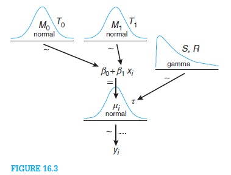
- roulette method(priors)
- joint_plot or kde overlap plot http://nbviewer.ipython.org/gist/mwaskom/8224591
- decision analysis
-- prediction of care = P(#alert_distribution) + P(time_between_alerts)_weibull_prior + P(#alerts_unseen)

# interactive (expert priors)
